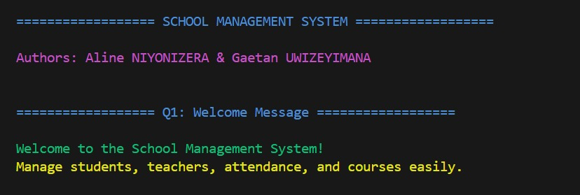
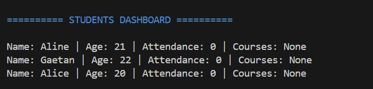
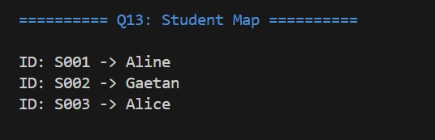
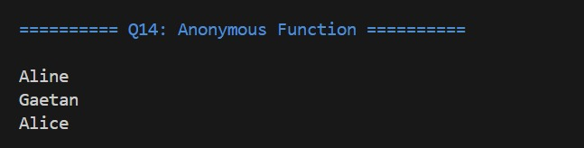
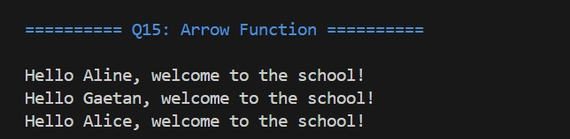
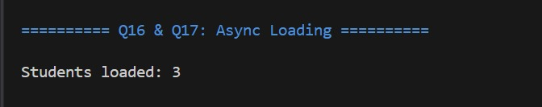
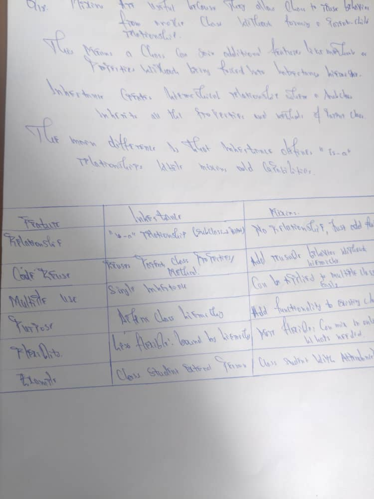
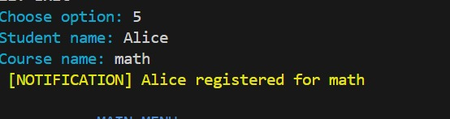
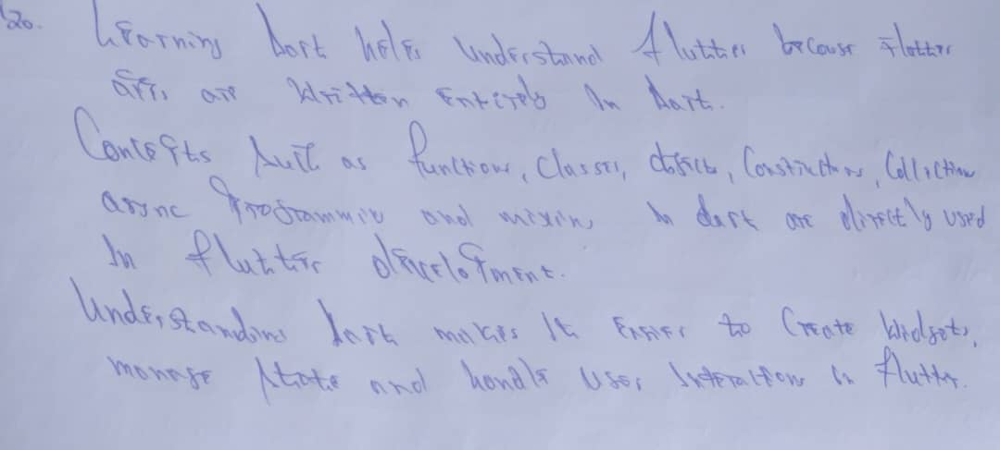

# Dart School Management System

[](https://dart.dev/)
[](https://flutter.dev/)

---

## Table of Contents

- [Project Overview](#project-overview)
- [Features](#features)
- [Lab Questions Coverage](#lab-questions-coverage)
- [Installation Instructions](#installation-instructions)
- [Usage](#usage)
- [Project Structure](#project-structure)
- [Submission Guidelines](#submission-guidelines)
- [Authors](#authors)
- [License](#license)
- [Acknowledgments](#acknowledgments)

---

##  Project Overview

This is a **console-based School Management System** built in **Dart** to demonstrate core programming concepts for **Dart Programming Lab 1**.

The system allows users to:

- Create students and teachers
- Mark attendance and track courses
- View a student dashboard
- Register courses with notifications
- Demonstrate collections, anonymous/arrow functions, and async programming

It covers all lab questions (Q1–Q20) with clear examples, proper structure, and an **interactive menu-based UI**.

## Features

- **Console-based, menu-driven UI** for easy navigation.
- **Student and teacher management** (creation, listing, and basic info).
- **Attendance tracking** with mixins for reusable behavior.
- **Course registration** with notification support.
- **Collections, anonymous functions, arrow functions, and async/await** demonstrated via dedicated menu options.

---


##  Lab Questions Coverage

The table below lists each lab question, its implementation in the system, and links to screenshots and the scanned handwritten report.

| Question | Feature / Implementation | Screenshot |
|:--------:|--------------------------|:----------:|
| **Q1** | `welcomeMessage()` function displays the welcome message |  |
| **Q2** | `createStudent()` with named parameters |  |
| **Q3** | `createTeacher()` with optional parameter |  |
| **Q4** | `Student` class with constructor |  |
| **Q5** | Create `Student` object & print details |  |
| **Q6** | `Person` class |  |
| **Q7** | `StudentPerson` inheritance & `introduce()` |  |
| **Q8** | `Registrable` interface |  |
| **Q9** | Implement `registerCourse()` in Student |  |
| **Q10** | `AttendanceMixin` |  |
| **Q11** | Apply AttendanceMixin & mark attendance |  |
| **Q12** | List of Students |  |
| **Q13** | Map of Students |  |
| **Q14** | Anonymous function demo |  |
| **Q15** | Arrow function demo |  |
| **Q16** | Async function `loadStudents()` |  |
| **Q17** | Await call in `main()` |  |
| **Q18** | Handwritten explanation of mixins vs inheritance |  |
| **Q19** | `NotificationMixin` demo |  |
| **Q20** | Handwritten paragraph: Dart & Flutter | |

### Handwritten Reports

All handwritten summaries for questions Q1-Q20 are compiled in a single PDF document:

**[ Download  Scanned Document Report (PDF)](screenshots/Dart%20programming%20lab1%20report.pdf)**

**[Download Word Document Output Report(Word)](screenshots/Dart%20Programing%20Lab1%20Report.docx)**

---

## Installation Instructions

### Prerequisites

- Dart SDK (version 2.12 or higher)
- Flutter SDK (optional, for Flutter-related features)

### Steps

1. **Install Dart & Flutter**:
   
   Follow the official guide: [Flutter Installation](https://flutter.dev/docs/get-started/install)

2. **Clone the Repository**:

   ```bash
   git clone https://github.com/Aline-CROIRE/dart-school-lab.git
   cd dart-school-lab
   ```

3. **Run the Project**:

   ```bash
   dart run main.dart
   ```

   The system runs entirely in the console.

---

##  Usage

When you run the program:

1.  You will see a **welcome message** (Q1).

2.  Use the menu to **create students and teachers** (Q2-Q3).

3. Access the **Student Dashboard** to view all students, attendance, and courses (Q11-Q13).

4. **Mark attendance** (Q10-Q11) and **register courses** (Q9, Q19).

5. **Anonymous & Arrow functions** are accessible via menu (Q14-Q15).

6. The system preloads demo students: **Aline**, **Gaetan**, **Alice**.

7.  **Exit** the program anytime using the menu option.

### Sample Menu

```
========================================
   DART SCHOOL MANAGEMENT SYSTEM
========================================
1. Create Student
2. Create Teacher
3. Student Dashboard
4. Mark Attendance
5. Register Course
6. Demo Functions
7. Exit
========================================
Enter your choice:
```

---

##  Project Structure

```
dart-school-lab/
│
├─ main.dart                    # All Dart code implementing Q1-Q20
├─ README.md                    # Project description & usage instructions
└─ screenshots/                 # Screenshots and scanned report
   ├─ q1.jpeg
   ├─ q2.jpeg
   ├─ q3.jpeg
   ├─ ...
   ├─ q20.jpeg
   └─ Dart programming lab1 report.pdf   # Complete handwritten report (Q1-Q20)
```

---


##  Submission Guidelines

To ensure your project meets all lab requirements:

- [ ] Make sure your **GitHub repository is public**
- [ ] Include `main.dart` and `README.md`
- [ ] Add **screenshots** (`.jpeg` format) for each question Q1-Q20 in the `screenshots/` folder
- [ ] Add **scanned handwritten report** as a single PDF (`Dart programming lab1 report.pdf`) in the `screenshots/` folder
- [ ] Create a **Word document** compiling all screenshots for submission
- [ ] Test the program to ensure all features work correctly
- [ ] Verify all links in the README are functional
- [ ] Ensure all screenshot files are named correctly (q1.jpeg, q2.jpeg, etc.)

Following these steps ensures the project is ready for assessment.

---

## 👥 Authors

<table>
  <tr>
    <td align="center">
      <a href="https://github.com/Aline-CROIRE">
        
        <br />
        <sub><b>Aline NIYONIZERA</b></sub>
      </a>
    </td>
    <td align="center">
      <a href="https://github.com/GaetanL90">
        
        <br />
        <sub><b>Gaetan UWIZEYIMANA</b></sub>
      </a>
    </td>
  </tr>
</table>

---

##  License

This project is created for **educational purposes** as part of **Dart Programming Lab 1**.

```
Copyright © 2026 Aline NIYONIZERA & Gaetan UWIZEYIMANA

Permission is hereby granted to use this software for educational purposes only.
```

---

##  Acknowledgments

- Thanks to our instructors for guidance
- Dart and Flutter documentation
- The open-source community

---

<div align="center">

[⬆ Back to Top](#dart-school-management-system)

</div>
